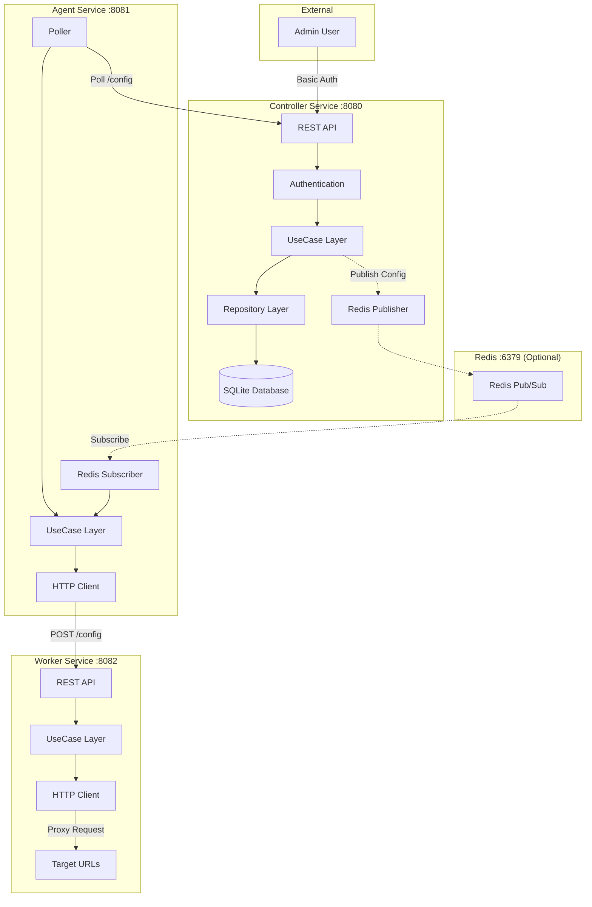
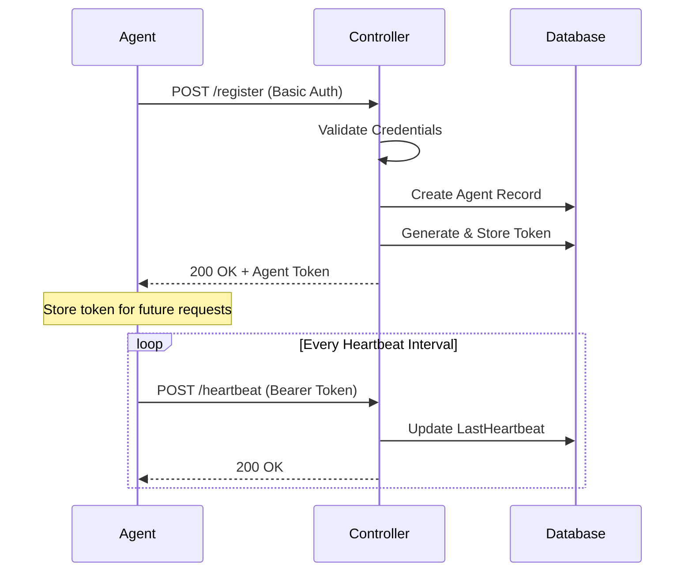
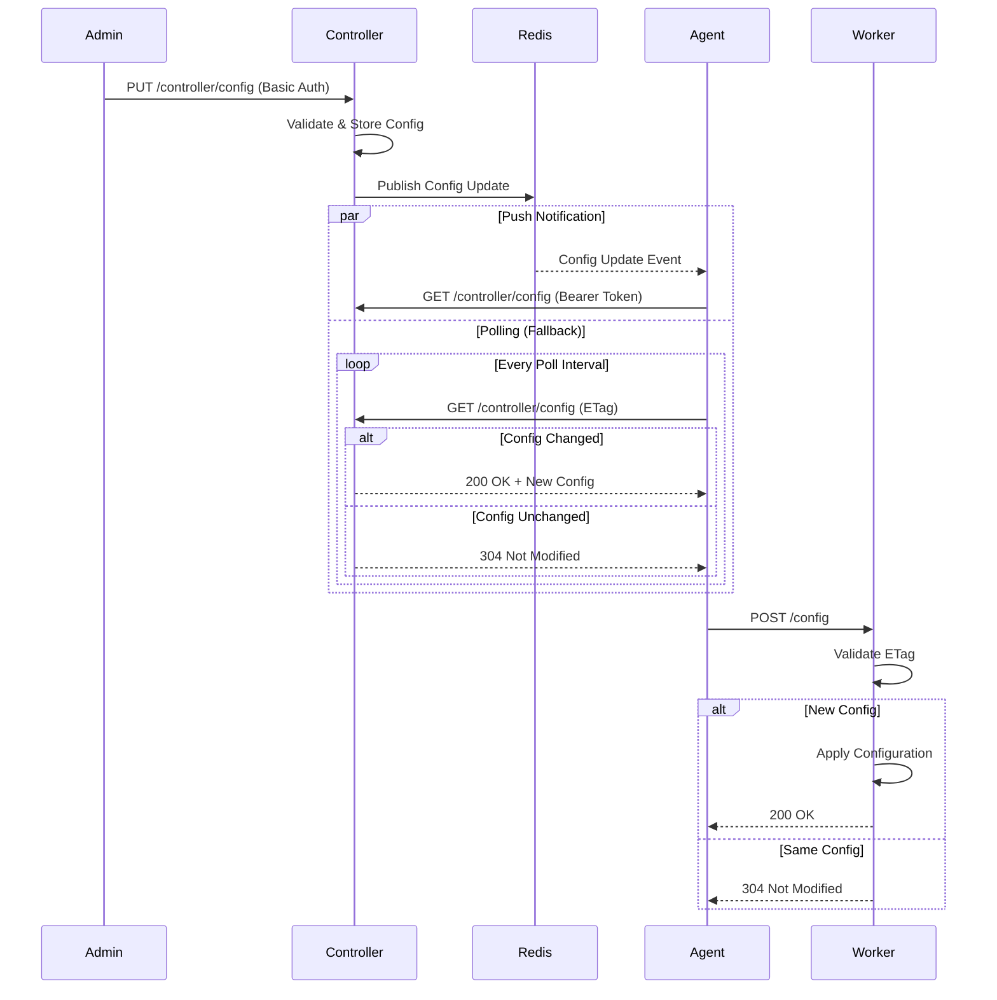

# Service Distribute Management

Distributed configuration management system with controller, agent, and worker services.

## Table of Contents
- [Overview](#overview)
- [Prerequisites](#prerequisites)
- [Quick Start](#quick-start)
- [System Design Principles](#system-design-principles)
- [Services](#services)
- [Architecture & Components](#architecture--components)
- [Project Structure](#project-structure)
- [Libraries & Packages](#libraries--packages)
- [Development](#development)
- [API Documentation](#api-documentation)
- [Documentation](#documentation)
- [License](#license)

---

## Overview

Service Distribute Management is a distributed system for managing and distributing configuration across multiple locations. It consists of three core services:

- **Controller**: Central management hub that stores configurations and manages agent registrations
- **Agent**: Polling service that bridges Controller and Worker, fetching and forwarding configuration updates
- **Worker**: Execution service that receives configurations and proxies HTTP requests to target URLs

The system supports both push-based (Redis pub/sub) and poll-based configuration distribution with automatic fallback for resilience.

---

## Prerequisites

### For Docker Deployment
- **Docker Engine**: 20.10 or higher
- **Docker Compose**: 2.0 or higher
- **Ports**: 8080 (Controller), 8082 (Worker), 6379 (Redis - optional)

### For Local Development
- **Go**: 1.25.0 or higher ([download](https://golang.org/dl/))
- **Make**: For build automation (optional but recommended)
- **swag**: For Swagger documentation generation
  ```bash
  go install github.com/swaggo/swag/cmd/swag@latest
  ```
- **Git**: For version control
- **SQLite**: Included in Go dependencies (no separate installation needed)

---

## Quick Start

### Docker Deployment (Recommended)

#### 1. Setup
1. Clone the repository:
   ```bash
   git clone <repository-url>
   cd service-distribute-management
   ```

2. Create environment file:
   ```bash
   cp .env.example .env.local
   # Or use the .env file created during setup
   ```

3. Edit `.env` and set secure passwords:
   ```bash
   # IMPORTANT: Change default passwords!
   ADMIN_PASSWORD=your-secure-password
   AGENT_PASSWORD=your-secure-agent-password
   REDIS_PASSWORD=your-secure-redis-password
   ```

4. Start all services:
   ```bash
   docker-compose up -d
   ```

5. Verify services are running:
   ```bash
   docker-compose ps
   ```

6. Test the controller API:
   ```bash
   curl -u admin:your-password http://localhost:8080/controller/config
   ```

6. Test the controller API:
   ```bash
   curl -u admin:your-password http://localhost:8080/health
   ```

For detailed Docker documentation, see [docs/DOCKER.md](docs/DOCKER.md).

### Local Development Setup

#### 1. Clone and Install Dependencies

```bash
# Clone repository
git clone <repository-url>
cd service-distribute-management

# Download dependencies
go mod download
# Or use Make
make install
```

#### 2. Build Services

```bash
# Build all services
make build service=controller
make build service=agent
make build service=worker

# Binaries will be in ./app/ directory
```

#### 3. Configure Environment

```bash
# Create .env file or export variables
export CONTROLLER_ADDR=:8080
export DATABASE_PATH=./data/controller.db
export ADMIN_USER=admin
export ADMIN_PASSWORD=admin
export AGENT_USER=agent
export AGENT_PASSWORD=agentpass
```

See [docs/ENVIRONMENT.md](docs/ENVIRONMENT.md) for complete environment variable reference.

#### 4. Run Services Locally

```bash
# Terminal 1: Start Controller
make run service=controller
# Or directly
./app/controller

# Terminal 2: Start Worker
make run service=worker

# Terminal 3: Start Agent
export CONTROLLER_URL=http://localhost:8080
export WORKER_URL=http://localhost:8082
make run service=agent
```

#### 5. Verify Services

```bash
# Check Controller health
curl http://localhost:8080/health

# Check Worker health
curl http://localhost:8082/health

# Check Agent health (if accessible)
curl http://localhost:8081/health
```

---

## System Design Principles

The Service Distribute Management system follows modern software architecture patterns and Go best practices.

### Layered Architecture

The codebase follows a clean, three-layer architecture pattern:

```
Handler Layer (HTTP)
    ↓ DTOs
UseCase Layer (Business Logic)
    ↓ Domain Models
Repository Layer (Data Access)
```

**Benefits:**
- Clear separation of concerns
- Testability through interface mocking
- Independent layer evolution
- Easy to understand and maintain

**Implementation:**
- **Handler Layer** (`internal/server/*/handler/`): HTTP request/response handling using Fiber framework
- **UseCase Layer** (`internal/server/*/usecase/`): Business logic orchestration, validation, and coordination
- **Repository Layer** (`internal/server/*/repository/`): Data persistence (SQLite) and external API clients
- **DTO Layer** (`internal/server/*/dto/`): Data Transfer Objects for API contracts

### Dependency Injection

Centralized dependency management through the `deps.App` struct provides:
- Explicit dependencies (no globals)
- Easy testing with mock implementations
- Lifecycle management (startup/shutdown)
- Resource sharing (database, logger, middleware)

**Example:**
```go
type App struct {
    Fiber      *fiber.App
    Logger     *logger.Logger
    Database   *gorm.DB
    Middleware *middleware.Middleware
    Poller     poll.Poller
    PubSub     pubsub.PubSub
}
```

### Interface-Driven Design

Interfaces enable flexibility and testability:
- Repository interfaces for data access abstraction
- UseCase interfaces for business logic mocking
- Poller and PubSub interfaces for strategy pattern
- Middleware interfaces for pluggable authentication

**Example:**
```go
type Repository interface {
    CreateAgent(agent *models.Agent) error
    GetAgent(agentID string) (*models.Agent, error)
    UpdateAgent(agent *models.Agent) error
}
```

### Key Design Patterns

| Pattern | Implementation | Purpose |
|---------|---------------|---------|
| **Repository** | `repository/repository.go` | Data access abstraction |
| **Factory** | `New*()` constructors | Object creation |
| **Dependency Injection** | `deps.App` struct | Dependency management |
| **Middleware Chain** | Fiber middleware | Request processing pipeline |
| **Strategy** | Poller/PubSub interfaces | Pluggable polling/push mechanisms |
| **Observer** | Redis pub/sub | Event notification |
| **Retry with Backoff** | `pkg/retry` | Resilient external calls |

### Error Handling

Consistent error handling with:
- Structured error responses (`pkg/wrapper`)
- HTTP status code mapping
- Validation error translation
- Centralized error middleware
- Contextual logging with Zap

### Idempotency

Configuration updates are idempotent using ETags:
- Prevents redundant updates when configuration hasn't changed
- Reduces network traffic and processing
- Safe to retry operations

---

## Services

### Controller Service

**Port:** 8080 | **Purpose:** Central management hub

The Controller is the heart of the system, responsible for:
- **Agent Management**: Registration, authentication, heartbeat monitoring, and lifecycle management
- **Configuration Storage**: SQLite database for configurations and agent metadata
- **Configuration Distribution**: Serves configurations to agents via REST API
- **Push Notifications** (optional): Redis pub/sub for instant configuration delivery
- **Admin API**: Management endpoints for configuration updates and agent administration

**Key Features:**
- Basic Auth for registration and admin operations
- Token-based auth for registered agents
- SQLite database with GORM for data persistence
- Configurable polling intervals per agent
- Agent heartbeat monitoring for health tracking
- Token rotation for security

**API Endpoints:**
- `POST /register` - Agent registration
- `GET /controller/config` - Get configuration (agents)
- `PUT /controller/config` - Update configuration (admin)
- `POST /heartbeat` - Agent heartbeat
- `GET /agents` - List all agents (admin)
- `PUT /agents/:id/poll-interval` - Update poll interval
- `POST /agents/:id/token/rotate` - Rotate agent token
- `GET /health` - Health check

### Agent Service

**Port:** 8081 (internal) | **Purpose:** Configuration polling and forwarding

The Agent acts as a bridge between Controller and Worker:
- **Polling**: Fetches configuration from Controller at configurable intervals
- **Push Support**: Subscribes to Redis pub/sub for instant updates (optional)
- **Hybrid Mode**: Combines push notifications with fallback polling for resilience
- **Registration**: Self-registers with Controller using exponential backoff retry
- **Heartbeat**: Sends periodic heartbeats to Controller for health monitoring
- **Configuration Forwarding**: Delivers updates to Worker service

**Key Features:**
- Exponential backoff for registration retries
- ETag-based caching to avoid redundant updates
- Graceful fallback when Redis is unavailable
- HTTP client with configurable timeouts
- Token-based authentication after registration
- Concurrent request handling with errgroup

**Resilience:**
- Automatic retry on Controller connection failure
- Fallback to polling if Redis pub/sub fails
- Heartbeat mechanism detects disconnections
- Configurable timeouts and retry intervals

### Worker Service

**Port:** 8082 | **Purpose:** Configuration execution and HTTP proxy

The Worker receives configurations from Agent and executes requests:
- **Configuration Reception**: Accepts configuration updates from Agent
- **HTTP Proxy**: Routes requests to target URLs based on configuration
- **Idempotent Updates**: Uses ETags to prevent redundant configuration processing
- **No Authentication**: Internal service, relies on network isolation

**Key Features:**
- ETag validation for idempotent config updates
- HTTP client for proxying to target URLs
- Configurable request timeouts
- Minimal resource footprint

**API Endpoints:**
- `POST /config` - Receive configuration from Agent
- `POST /hit` - Proxy HTTP request to target
- `GET /health` - Health check

### Redis Service (Optional)

**Port:** 6379 | **Purpose:** Push notification pub/sub

Redis provides real-time configuration push:
- Pub/Sub channels for instant configuration delivery
- Reduces polling load on Controller by 80-90%
- Optional component - system works without it
- Fallback to polling ensures resilience

**Benefits:**
- Near-instant configuration propagation (< 1 second)
- Reduced network traffic and CPU usage
- Scalable to thousands of agents
- High availability with Redis Sentinel/Cluster

---

## Architecture & Components

### System Architecture Diagram




### Configuration Flow

#### Agent Registration Sequence




#### Configuration Distribution Sequence




### Polling and Pub/Sub Mechanism

The system supports two modes for configuration distribution:

**1. Poll-Only Mode** (Redis disabled):
- Agent polls Controller at configurable interval (default: 5 seconds)
- ETag header prevents redundant updates
- Simple, reliable, no external dependencies

**2. Hybrid Push/Pull Mode** (Redis enabled):
- Controller publishes to Redis channel on config update
- Agents subscribe to Redis channel for instant notifications
- Fallback polling continues at longer interval (30-60 seconds)
- Best of both worlds: Real-time updates + resilience

**Configuration:**
```bash
# Poll-only (Simple)
REDIS_ENABLED=false
POLL_INTERVAL=5

# Hybrid (Recommended)
REDIS_ENABLED=true
POLL_INTERVAL=10  # Less frequent
FALLBACK_POLL_ENABLED=true
FALLBACK_POLL_INTERVAL=60  # Safety net
```

### Error Handling and Retry Logic

**Exponential Backoff:**
- Used for agent registration retries
- Configurable: initial backoff, max backoff, multiplier
- Optional jitter (±25%) prevents thundering herd
- Context-aware cancellation

**Example Configuration:**
```bash
REGISTRATION_MAX_RETRIES=10
REGISTRATION_INITIAL_BACKOFF=1s
REGISTRATION_MAX_BACKOFF=60s
REGISTRATION_BACKOFF_MULTIPLIER=2.0
```

**Retry Sequence:**
1. Attempt 1: Immediate
2. Attempt 2: 1s delay
3. Attempt 3: 2s delay
4. Attempt 4: 4s delay
5. Attempt 5: 8s delay
...
10. Attempt 10: 60s delay (capped at max)

### Logging System

**Structured Logging with Uber Zap:**
- **Formats**: JSON (production) or Console (development)
- **Levels**: Debug, Info, Warn, Error, Fatal
- **Contextual Fields**: agent_id, config_version, request_id
- **HTTP Logging**: Canonical logger middleware logs all requests

**Example Log Entry (JSON):**
```json
{
  "level": "info",
  "ts": "2026-01-31T12:34:56.789Z",
  "caller": "handler/handler.go:123",
  "msg": "Configuration updated",
  "agent_id": "agent-001",
  "config_version": "v1.2.3",
  "status": 200,
  "duration_ms": 45
}
```

For detailed Docker documentation, see [docs/DOCKER.md](docs/DOCKER.md).

---

## Project Structure

```
service-distribute-management/
├── cmd/                          # Service entry points
│   ├── controller/
│   │   └── main.go              # Controller service main
│   ├── agent/
│   │   └── main.go              # Agent service main
│   └── worker/
│       └── main.go              # Worker service main
│
├── internal/                     # Private application code
│   ├── config/
│   │   └── config.go            # Environment-based configuration
│   ├── models/
│   │   ├── agent.go             # Agent data model
│   │   ├── configuration.go     # Configuration data model
│   │   └── ...                  # Other models
│   └── server/                  # Server implementations
│       ├── controller/
│       │   ├── dto/             # Data Transfer Objects
│       │   ├── handler/         # HTTP handlers
│       │   ├── repository/      # Data access layer
│       │   └── usecase/         # Business logic
│       ├── agent/
│       │   └── ...              # Same structure
│       └── worker/
│           └── ...              # Same structure
│
├── pkg/                          # Reusable packages
│   ├── auth/                    # Authentication service
│   ├── database/                # Database utilities (SQLite)
│   ├── deps/                    # Dependency injection
│   ├── logger/                  # Structured logging (Zap)
│   ├── middleware/              # HTTP middleware
│   ├── poll/                    # Polling mechanism
│   ├── pubsub/                  # Redis pub/sub
│   ├── retry/                   # Exponential backoff
│   ├── validator/               # Request validation
│   └── wrapper/                 # API response wrapper
│
├── docs/                         # Documentation
│   ├── DOCKER.md                # Docker deployment guide
│   ├── ENVIRONMENT.md           # Environment variables reference
│   ├── PERFORMANCE.md           # Performance tuning guide
│   ├── SECURITY.md              # Security best practices
│   ├── DEPLOYMENT.md            # Deployment examples
│   ├── controller/              # Controller API docs (Swagger)
│   ├── worker/                  # Worker API docs (Swagger)
│   └── agent-worker/            # Agent+Worker deployment docs
│
├── docker/                       # Dockerfiles
│   ├── controller/
│   │   └── Dockerfile
│   ├── agent/
│   │   └── Dockerfile
│   └── worker/
│       └── Dockerfile
│
├── data/                         # SQLite database storage
├── app/                          # Compiled binaries (created by build)
├── docker-compose.yml            # All-in-one deployment
├── docker-compose.controller.yml # Standalone controller
├── docker-compose.agent-worker.yml # Agent+Worker pair
├── go.mod                        # Go module dependencies
├── go.sum                        # Dependency checksums
├── Makefile                      # Build automation
└── README.md                     # This file
```

### Directory Descriptions

| Directory | Purpose |
|-----------|---------|
| **cmd/** | Main applications - entry points for each service |
| **internal/** | Private application code - not importable by other projects |
| **internal/config/** | Configuration loading from environment variables |
| **internal/models/** | Database models (GORM entities) |
| **internal/server/** | Service implementations with layered architecture |
| **pkg/** | Public, reusable packages that could be imported by other projects |
| **docs/** | Comprehensive documentation including API specs |
| **docker/** | Dockerfile definitions for each service |
| **data/** | Runtime data storage (SQLite database files) |

---

## Libraries & Packages

### Core Dependencies

| Library | Version | Purpose |
|---------|---------|---------|
| [Fiber](https://github.com/gofiber/fiber) | v2.52.6 | Fast, Express-inspired HTTP web framework |
| [GORM](https://gorm.io/) | v1.25.12 | ORM library for database operations |
| [go-sqlite3](https://github.com/mattn/go-sqlite3) | v1.14.24 | SQLite driver for database/sql |
| [Zap](https://github.com/uber-go/zap) | v1.27.0 | Blazing fast, structured logging |
| [validator](https://github.com/go-playground/validator) | v10.24.0 | Struct and field validation |
| [go-redis](https://github.com/redis/go-redis) | v9.0.0 | Type-safe Redis client |
| [uuid](https://github.com/google/uuid) | v1.6.0 | UUID generation and parsing |
| [goquery](https://github.com/PuerkitoBio/goquery) | v1.11.0 | HTML parsing (jQuery-like) |
| [swag](https://github.com/swaggo/swag) | v1.16.6 | Swagger documentation generation |

### Internal Packages

#### pkg/auth
**Purpose:** Authentication service for Basic Auth validation

**Features:**
- Username/password validation
- WWW-Authenticate header generation
- Used by middleware for auth enforcement

#### pkg/database
**Purpose:** SQLite database initialization and utilities

**Features:**
- GORM database setup
- Auto-migration for models
- WAL mode for better concurrency
- Connection management

#### pkg/deps
**Purpose:** Dependency injection container

**Features:**
- Centralized `App` struct
- Lifecycle management
- Shared resource access (DB, Logger, etc.)

#### pkg/logger
**Purpose:** Structured logging with Uber Zap

**Features:**
- JSON or Console output format
- Configurable log levels
- Contextual fields support
- Performance-optimized

**Usage:**
```go
logger.Info("Message", "field1", value1, "field2", value2)
```

#### pkg/middleware
**Purpose:** HTTP middleware components

**Components:**
- **BasicAuth**: Basic authentication middleware
- **AgentTokenAuth**: Bearer token validation
- **CanonicalLogger**: Structured HTTP request logging
- **ErrorHandler**: Centralized error response handling

#### pkg/poll
**Purpose:** Configurable polling mechanism

**Features:**
- Interval-based polling
- Multiple fetch functions
- Dynamic interval updates
- Graceful start/stop
- Context cancellation

**Usage:**
```go
poller := poll.NewPoller(ctx, 5*time.Second)
poller.AddFetch("config", fetchConfigFunc)
poller.Start()
```

#### pkg/pubsub
**Purpose:** Redis pub/sub abstraction

**Features:**
- Subscribe to channels
- Publish messages
- Health check support
- Connection pooling
- Interface-based (mockable)

#### pkg/retry
**Purpose:** Exponential backoff retry logic

**Features:**
- Configurable backoff parameters
- Optional jitter (±25% randomness)
- Max retry limit
- Context-aware cancellation

**Usage:**
```go
backoff := retry.NewExponentialBackoff(
    5,              // max retries
    1*time.Second,  // initial backoff
    30*time.Second, // max backoff
    2.0,            // multiplier
    true,           // jitter
)

err := backoff.Retry(ctx, func() error {
    return register()
})
```

#### pkg/validator
**Purpose:** Request validation using go-playground/validator

**Features:**
- Struct tag validation
- Custom error messages
- Integration with Fiber

**Usage:**
```go
type RegisterRequest struct {
    AgentID string `json:"agentId" validate:"required,min=3"`
}
```

#### pkg/wrapper
**Purpose:** Standardized API response format

**Features:**
- Consistent JSON structure
- Success/error responses
- HTTP status code mapping

**Response Format:**
```json
{
  "success": true,
  "data": { ... },
  "message": "Operation successful"
}
```

---

## Development

### Build Commands

```bash
# Build specific service
make build service=controller
make build service=agent
make build service=worker

# Build all services
make build-all

# Build Docker images
make build-docker service=controller
```

### Run Commands

```bash
# Run specific service locally
make run service=controller
make run service=agent
make run service=worker

# Run with Docker Compose
make run-docker
# Or
docker-compose up -d
```

### Code Quality

```bash
# Format code
make format
# Or
go fmt ./...

# Tidy dependencies
make tidy
# Or
go mod tidy

# Run tests
make test
# Or
go test ./...
```

### Swagger Documentation

Generate or update API documentation after changing handlers or DTOs:

```bash
# Generate all Swagger docs
make swagger-generate

# Generate Controller docs only
make swagger-controller

# Generate Worker docs only
make swagger-worker
```

### Environment Configuration

For local development, create a `.env` file or export environment variables:

```bash
# Example .env for local development
CONTROLLER_ADDR=:8080
DATABASE_PATH=./data/controller.db
ADMIN_USER=admin
ADMIN_PASSWORD=admin
AGENT_USER=agent
AGENT_PASSWORD=agentpass
POLL_INTERVAL=5
LOG_FORMAT=console
LOG_LEVEL=debug
```

**Load .env file:**
```bash
export $(cat .env | xargs)
```

See [docs/ENVIRONMENT.md](docs/ENVIRONMENT.md) for complete environment variable reference.

### Testing

```bash
# Run all tests
go test ./...

# Run tests with coverage
go test -cover ./...

# Run tests for specific package
go test ./pkg/retry

# Run with verbose output
go test -v ./...

# Run specific test
go test -v -run TestExponentialBackoff ./pkg/retry
```

### Debugging

**VS Code Launch Configuration (.vscode/launch.json):**
```json
{
  "version": "0.2.0",
  "configurations": [
    {
      "name": "Debug Controller",
      "type": "go",
      "request": "launch",
      "mode": "auto",
      "program": "${workspaceFolder}/cmd/controller",
      "env": {
        "CONTROLLER_ADDR": ":8080",
        "DATABASE_PATH": "./data/controller.db",
        "ADMIN_PASSWORD": "admin",
        "LOG_LEVEL": "debug"
      }
    },
    {
      "name": "Debug Agent",
      "type": "go",
      "request": "launch",
      "mode": "auto",
      "program": "${workspaceFolder}/cmd/agent",
      "env": {
        "CONTROLLER_URL": "http://localhost:8080",
        "WORKER_URL": "http://localhost:8082",
        "LOG_LEVEL": "debug"
      }
    }
  ]
}
```

### Makefile Commands Reference

| Command | Description |
|---------|-------------|
| `make run service=<name>` | Run service locally |
| `make build service=<name>` | Build binary to ./app |
| `make build-docker service=<name>` | Build Docker image |
| `make run-docker` | Start all services with Docker Compose |
| `make format` | Format Go code |
| `make test` | Run tests |
| `make tidy` | Tidy dependencies |
| `make install` | Download dependencies |
| `make swagger-generate` | Generate all Swagger docs |
| `make swagger-controller` | Generate Controller docs |
| `make swagger-worker` | Generate Worker docs |

---

## Services
- **Controller**: http://localhost:8080 - Central management service
- **Worker**: http://localhost:8082 - Configuration execution service
- **Agent**: Internal client connecting controller and worker
- **Redis**: http://localhost:6379 - Optional pub/sub for push notifications

## Development

### Build from Source
```bash
# Controller
go build ./cmd/controller

# Agent
go build ./cmd/agent

# Worker
go build ./cmd/worker
```

### Run Locally
```bash
# Set environment variables
export CONTROLLER_ADDR=:8080
export DATABASE_PATH=./data.db
export ADMIN_USER=admin
export ADMIN_PASSWORD=admin

# Start controller
./controller
```

## Documentation
- [Docker Deployment Guide](docs/DOCKER.md)

## API Documentation

This project includes interactive Swagger/OpenAPI documentation for both Controller and Worker APIs.

### Accessing Swagger UI

**Controller API Documentation:**
- **URL**: http://localhost:8080/swagger/index.html
- **Authentication Required**: Yes (for testing protected endpoints)
- **Credentials**:
  - Agent endpoints: `agent` / `agentpass` (Basic Auth for registration)
  - Agent authenticated: Bearer token (after registration)
  - Admin endpoints: `admin` / `password` (Basic Auth)

**Worker API Documentation:**
- **URL**: http://localhost:8082/swagger/index.html
- **Authentication**: No authentication required (internal service)

### API Endpoints Summary

**Controller API** (Port 8080):
- `GET /health` - Health check (no auth)
- `POST /register` - Agent registration (Basic Auth: agent)
- `GET /controller/config` - Get configuration (Bearer Token)
- `PUT /controller/config` - Update configuration (Basic Auth: admin)
- `POST /heartbeat` - Agent heartbeat (Bearer Token)
- `GET /agents` - List all agents (Basic Auth: admin)
- `GET /agents/:id` - Get agent details (Basic Auth: admin)
- `PUT /agents/:id/poll-interval` - Update poll interval (Basic Auth: admin)
- `POST /agents/:id/token/rotate` - Rotate agent token (Basic Auth: admin)
- `DELETE /agents/:id` - Delete agent (Basic Auth: admin)

**Worker API** (Port 8082):
- `GET /health` - Health check
- `POST /config` - Receive configuration from Agent
- `POST /hit` - Proxy HTTP request to target URL

### Regenerating API Documentation

After modifying any API handlers or DTOs, regenerate the Swagger documentation:

```bash
# Regenerate all documentation
make swagger-generate

# Or regenerate individually
make swagger-controller
make swagger-worker
```

**Manual regeneration:**
```bash
swag init -g cmd/controller/main.go -o docs/controller
swag init -g cmd/worker/main.go -o docs/worker
```

The generated files are located in:
- `docs/controller/` - Controller API documentation (docs.go, swagger.json, swagger.yaml)
- `docs/worker/` - Worker API documentation (docs.go, swagger.json, swagger.yaml)

---

## Documentation

### Comprehensive Guides

- **[Docker Deployment Guide](docs/DOCKER.md)** - Complete Docker deployment instructions for all scenarios
- **[Environment Variables Reference](docs/ENVIRONMENT.md)** - All environment variables for Controller, Agent, Worker, and Redis
- **[Performance Guide](docs/PERFORMANCE.md)** - Performance tuning, scaling strategies, resource limits, and benchmarking
- **[Security Best Practices](docs/SECURITY.md)** - Authentication, credential management, network security, and compliance
- **[Deployment Examples](docs/DEPLOYMENT.md)** - Architecture examples: all-in-one, standalone controller, distributed, and HA setups

### API Documentation

- **[Controller API](docs/controller/README.md)** - Standalone Controller deployment
- **[Worker API Swagger](http://localhost:8082/swagger/index.html)** - Interactive API documentation (when running)
- **[Controller API Swagger](http://localhost:8080/swagger/index.html)** - Interactive API documentation (when running)
- **[Agent-Worker Deployment](docs/agent-worker/README.md)** - Distributed Agent+Worker pair deployment
